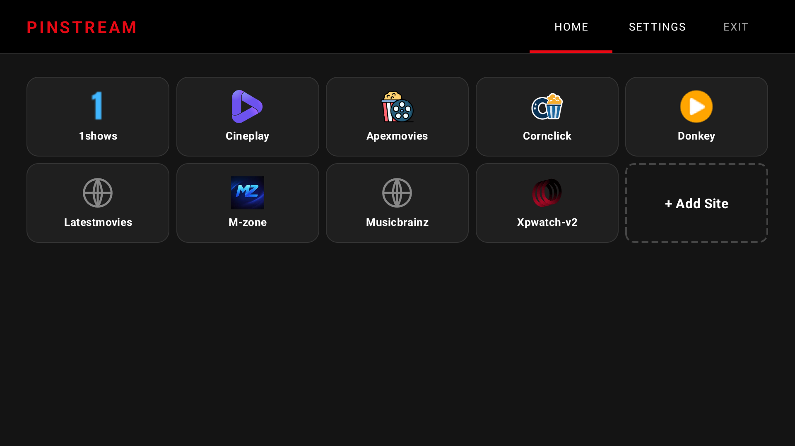

# BitStream

**Your favorite streaming sites. All in one place. Built for the big screen.**

BitStream is a free, open-source Android TV launcher that puts every streaming site you love just one click away — no subscriptions, no sign-ups, no bloat. Browse your pinned sites from a clean TV-optimized grid, and jump straight into the content you want.

---

## Why BitStream?

Tired of juggling multiple apps, logging in repeatedly, or hunting through cluttered interfaces just to watch something? BitStream cuts through the noise.

- **One home for everything** — pin any streaming website and access it instantly from your TV remote
- **Works with any site** — if it has a URL, it works in BitStream
- **Built for Android TV** — D-pad navigation, TV-scale UI, no touch required
- **Ad-free browsing** — built-in ad blocker keeps your stream clean
- **Lightweight** — under 5 MB, no background services, no trackers

---

## Features

### Streaming Hub
A beautiful, distraction-free grid of all your pinned streaming sites. Favorites float to the top. Add, edit, or remove sites in seconds.

### Full-Featured TV Browser
Each site opens in a custom WebView browser tuned for TV. D-pad cursor control, scroll speed settings, and keyboard support (Shift+Enter for long-press) give you the precision of a mouse without leaving your couch.

### Built-In Ad Blocker
BitStream ships with a domain blocklist and injects CSS/JS to suppress ads and anti-adblock walls — so you see the content, not the noise.

### Remote Site Sync
Site lists sync automatically from a remote config, so new streaming sources appear without any action on your part.

### Automatic Updates
BitStream checks for new versions in the background and prompts you to download and install updates directly — no app store needed.

### Tunable Controls
Dial in pointer speed and scroll speed to match your remote and your preference.

---

## Installation

1. Download the latest `app-release.apk` from the [Releases](../../releases) page
2. On your Android TV, enable **Install from Unknown Sources** in Settings → Security
3. Sideload the APK using a USB drive, file manager, or [adb](https://developer.android.com/tools/adb):
   ```
   adb install app-release.apk
   ```
4. Launch BitStream from your TV home screen

---

## Requirements

- Android 5.0 (API 21) or higher
- Android TV or any Android device with a remote/D-pad
- Internet connection

---

## Adding Your Own Sites

1. Open BitStream and navigate to the home grid
2. Select **+ Add Site**
3. Enter the URL of any streaming site
4. It appears instantly in your grid — long-press to edit, delete, or favorite

---

## Built With

- [Kotlin](https://kotlinlang.org/) — 100% Kotlin codebase
- [AndroidX Leanback](https://developer.android.com/jetpack/androidx/releases/leanback) — TV-optimized UI components
- [Glide](https://github.com/bumptech/glide) — fast favicon loading
- [Media3 / ExoPlayer](https://developer.android.com/media/media3) — media playback engine

---

## License

This project is open source. See [LICENSE](LICENSE) for details.

---

> BitStream does not host, distribute, or endorse any content. It is a browser launcher that accesses publicly available websites.
